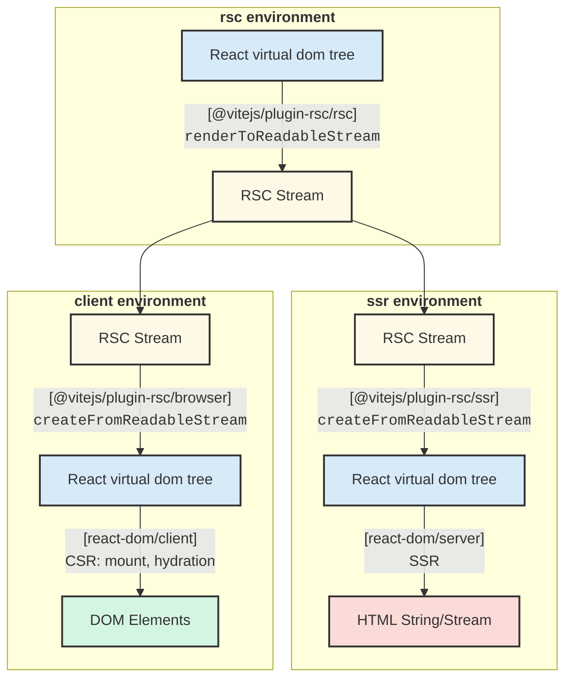

# @vitejs/plugin-rsc

This package provides [React Server Components](https://react.dev/reference/rsc/server-components) (RSC) support for Vite.

## Features

- **Framework-less RSC experience**: The plugin implements [RSC conventions](https://react.dev/reference/rsc/server-components) and provides low level `react-server-dom` runtime API without framework-specific abstractions.
- **CSS support**: CSS is automatically code-split both at client and server components and they are injected upon rendering.
- **HMR support**: Enables editing both client and server components without full page reloads.
- **Runtime agnostic**: Built on [Vite environment API](https://vite.dev/guide/api-environment.html) and works with other runtimes (e.g., [`@cloudflare/vite-plugin`](https://github.com/cloudflare/workers-sdk/tree/main/packages/vite-plugin-cloudflare)).

## Getting Started

You can start a project by copying an example locally by:

```sh
npx degit vitejs/vite-plugin-react/packages/plugin-rsc/examples/starter my-app
```

## Examples

- [`./examples/starter`](./examples/starter)
  - This example provides an in-depth overview of API with inline comments to explain how they function within RSC-powered React application.
- [`./examples/react-router`](./examples/react-router)
  - This demonstrates how to integrate [experimental React Router RSC API](https://remix.run/blog/rsc-preview) with this plugin.
    It also includes `@cloudflare/vite-plugin` integration.
- [`./examples/basic`](./examples/basic)
  - This is mainly used for e2e testing and include various advanced RSC usages (e.g. `"use cache"` example).
    It also uses a high level `@vitejs/plugin-rsc/extra/{rsc,ssr,browser}` API for quick setup.
- [`./examples/ssg`](./examples/ssg)
  - Static site generation (SSG) example with MDX and client components for interactivity.

## Basic Concepts

This example is a simplified version of [`./examples/starter`](./examples/starter). You can read [`./examples/starter/src/framework/entry.{rsc,ssr,browser}.tsx`](./examples/starter/src/framework) for more in-depth commentary, which includes server function handling and client-side RSC re-fetching/re-rendering.

This is the diagram to show the basic flow of RSC rendering process. See also https://github.com/hi-ogawa/vite-plugins/discussions/606.



- [`vite.config.ts`](./examples/starter/vite.config.ts)

```js
import rsc from '@vitejs/plugin-rsc'
import { defineConfig } from 'vite'

export default defineConfig({
  plugins: [
    // add plugin
    rsc(),
  ],

  // specify entry point for each environment.
  environments: {
    // `rsc` environment loads modules with `react-server` condition.
    // this environment is responsible for:
    // - RSC stream serialization (React VDOM -> RSC stream)
    // - server functions handling
    rsc: {
      build: {
        rollupOptions: {
          input: {
            index: './src/framework/entry.rsc.tsx',
          },
        },
      },
    },

    // `ssr` environment loads modules without `react-server` condition.
    // this environment is responsible for:
    // - RSC stream deserialization (RSC stream -> React VDOM)
    // - traditional SSR (React VDOM -> HTML string/stream)
    ssr: {
      build: {
        rollupOptions: {
          input: {
            index: './src/framework/entry.ssr.tsx',
          },
        },
      },
    },

    // client environment is used for hydration and client-side rendering
    // this environment is responsible for:
    // - RSC stream deserialization (RSC stream -> React VDOM)
    // - traditional CSR (React VDOM -> Browser DOM tree mount/hydration)
    // - refetch and re-render RSC
    // - calling server functions
    client: {
      build: {
        rollupOptions: {
          input: {
            index: './src/framework/entry.browser.tsx',
          },
        },
      },
    },
  },
})
```

- [`entry.rsc.tsx`](./examples/starter/src/framework/entry.rsc.tsx)

```tsx
import * as ReactServer from '@vitejs/plugin-rsc/rsc' // re-export of react-server-dom/server.edge

// the plugin assumes `rsc` entry having default export of request handler
export default async function handler(request: Request): Promise<Response> {
  // serialization React VDOM to RSC stream
  const root = (
    <html>
      <body>
        <h1>Test</h1>
      </body>
    </html>
  )
  const rscStream = ReactServer.renderToReadableStream(root)

  // respond direct RSC stream request based on framework's convention
  if (request.url.endsWith('.rsc')) {
    return new Response(rscStream, {
      headers: {
        'Content-type': 'text/x-component;charset=utf-8',
      },
    })
  }

  // delegate to SSR environment for html rendering
  // `loadModule` is a helper API provided by the plugin for multi environment interaction.
  const ssrEntry = await import.meta.viteRsc.loadModule<
    typeof import('./entry.ssr.tsx')
  >('ssr', 'index')
  const htmlStream = await ssrEntry.handleSsr(rscStream)

  // respond html
  return new Response(htmlStream, {
    headers: {
      'Content-type': 'text/html',
    },
  })
}
```

- [`entry.ssr.tsx`](./examples/starter/src/framework/entry.ssr.tsx)

```tsx
import * as ReactClient from '@vitejs/plugin-rsc/ssr' // re-export of react-server-dom/client.edge
import * as ReactDOMServer from 'react-dom/server.edge'

export async function handleSsr(rscStream: ReadableStream) {
  // deserialize RSC stream back to React VDOM
  const root = await ReactClient.createFromReadableStream(rscStream)

  // helper API to allow referencing browser entry content from SSR environment
  const bootstrapScriptContent =
    await import.meta.viteRsc.loadBootstrapScriptContent('index')

  // render html (traditional SSR)
  const htmlStream = ReactDOMServer.renderToReadableStream(root, {
    bootstrapScriptContent,
  })

  return htmlStream
}
```

- [`entry.browser.tsx`](./examples/starter/src/framework/entry.browser.tsx)

```tsx
import * as ReactClient from "@vitejs/plugin-rsc/browser"; // re-export of react-server-dom/client.browser
import * as ReactDOMClient from "react-dom/client";

async function main() {
  // fetch and deserialize RSC stream back to React VDOM
  const rscResponse = await fetch(window.location.href + ".rsc);
  const root = await ReactClient.createFromReadableStream(rscResponse.body);

  // hydration (traditional CSR)
  ReactDOMClient.hydrateRoot(document, root);
}

main();
```

## `react-server-dom` API

### `@vitejs/plugin-rsc/rsc`

This module re-exports RSC runtime API provided by `react-server-dom/server.edge`

- `renderToReadableStream`: RSC serialization (React VDOM -> RSC stream)
- `createFromReadableStream`: RSC deserialization (RSC stream -> React VDOM). This is also available on rsc environment itself. For example, it allows saving serailized RSC and deserializing it for later use.
- `decodeAction/decodeReply/loadServerAction`: server function related...

### `@vitejs/plugin-rsc/ssr`

This module re-exports RSC runtime API provided by `react-server-dom/client.edge`

- `createFromReadableStream`: RSC deserialization (RSC stream -> React VDOM)

### `@vitejs/plugin-rsc/browser`

This module re-exports RSC runtime API provided by `react-server-dom/client.browser`

- `createFromReadableStream`: RSC deserialization (RSC stream -> React VDOM)
- `createFromFetch`: a robust way of `createFromReadableStream((await fetch("...")).body)`
- `encodeReply/setServerCallback`: server function related...

## Environment helper API

The plugin provides an additional helper for multi environment interaction.

### available on `rsc` or `ssr` environment

#### `import.meta.viteRsc.loadModule`

- Type: `(environmentName: "ssr" | "rsc", entryName: string) => Promise<T>`

This allows importing `ssr` environment module specified by `environments.ssr.build.rollupOptions.input[entryName]` inside `rsc` environment and vice versa.

During development, by default, this API assumes both `rsc` and `ssr` environments execute under the main Vite process. When enabling `rsc({ loadModuleDevProxy: true })` plugin option, the loaded module is implemented as a proxy with `fetch`-based RPC to call in node environment on the main Vite process, which for example, allows `rsc` environment inside cloudflare workers to access `ssr` environment on the main Vite process.

During production build, this API will be rewritten into a static import of the specified entry of other environment build and the modules are executed inside the same runtime.

For example,

```js
// ./entry.rsc.tsx
const ssrModule = await import.meta.viteRsc.loadModule("ssr", "index");
ssrModule.renderHTML(...);

// ./entry.ssr.tsx (with environments.ssr.build.rollupOptions.input.index = "./entry.ssr.tsx")
export function renderHTML(...) {}
```

### available on `rsc` environment

#### `import.meta.viteRsc.loadCss`

- Type: `(importer?: string) => React.ReactNode`

This allows collecting css which is imported through a current server module and injecting them inside server components.

```tsx
import './test.css'
import dep from './dep.tsx'

export function ServerPage() {
  // this will include css assets for "test.css"
  // and any css transitively imported through "dep.tsx"
  return (
    <>
      {import.meta.viteRsc.loadCss()}
      ...
    </>
  )
}
```

Where specifying `loadCss(<id>)`, it will collect css through the server module resolved by `<id>`.

```tsx
// virtual:my-framework-helper
export function Assets() {
  return <>
    {import.meta.viteRsc.loadCss("/routes/home.tsx")}
    {import.meta.viteRsc.loadCss("/routes/about.tsx")}
    {...}
  </>
}

// user-app.tsx
import { Assets } from "virtual:my-framework-helper";

export function UserApp() {
  return <html>
    <head>
      <Assets />
    </head>
    <body>...</body>
  </html>
}
```

#### `<id>?vite-rsc-css-export=<name>`

This special query convention provides automatic injection of `import.meta.viteRsc.loadCss`.

For example,

```tsx
// my-route.tsx
export function Page(props) {
  return <div>...</div>
}

// my-route.css?vite-rsc-css-export=Page
function Page(props) {
  return <div>...</div>
}

function __Page(props) {
  return (
    <>
      {import.meta.viteRsc.loadCss()}
      <Page {...props} />
    </>
  )
}

export { __Page as Page }
```

### available on `ssr` environment

#### `import.meta.viteRsc.loadBootstrapScriptContent("index")`

This provides a raw js code to execute a browser entry file specified by `environments.client.build.rollupOptions.input.index`. This is intended to be used with React DOM SSR API, such as [`renderToReadableStream`](https://react.dev/reference/react-dom/server/renderToReadableStream)

```js
import bootstrapScriptContent from 'virtual:vite-rsc/bootstrap-script-content'
import { renderToReadableStream } from 'react-dom/server.edge'

const bootstrapScriptContent =
  await import.meta.viteRsc.loadBootstrapScriptContent('index')
const htmlStream = await renderToReadableStream(reactNode, {
  bootstrapScriptContent,
})
```

### available on `client` environment

#### `rsc:update` event

This event is fired when server modules are updated, which can be used to trigger re-fetching and re-rendering of RSC components on browser.

```js
import * as ReactClient from '@vitejs/plugin-rsc/browser'

import.meta.hot.on('rsc:update', async () => {
  // re-fetch RSC stream
  const rscPayload = await ReactClient.createFromFetch(
    fetch(window.location.href + '.rsc'),
  )
  // re-render ...
})
```

## Plugin API

### `@vitejs/plugin-rsc`

```js
import rsc from '@vitejs/plugin-rsc'
import { defineConfig } from 'vite'

export default defineConfig({
  plugins: [
    rsc({
      // this is only a shorthand of specifying each rollup input via
      // `environments[name].build.rollupOptions.input.index`
      entries: {
        rsc: '...',
        ssr: '...',
        client: '...',
      },

      // by default, the plugin sets up middleware
      // using `default` export of `rsc` environment `index` entry.
      // this behavior can be customized by `serverHandler` option.
      serverHandler: false,

      // when `loadModuleDevProxy: true`, `import.meta.viteRsc.loadModule` is implemented
      // through `fetch` based RPC, which allows, for example, rsc environment inside
      // cloudflare workers to communicate with node ssr environment on main Vite process.
      loadModuleDevProxy: true,

      // by default, `loadCss()` helper is injected based on certain heuristics.
      // if it breaks, it can be opt-out or selectively applied based on files.
      rscCssTransform: { filter: (id) => id.includes('/my-app/') },

      // by default, the plugin uses a build-time generated encryption key for
      // "use server" closure argument binding.
      // This can be overwritten by configuring `defineEncryptionKey` option,
      // for example, to obtain a key through environment variable during runtime.
      // cf. https://nextjs.org/docs/app/guides/data-security#overwriting-encryption-keys-advanced
      defineEncryptionKey: 'process.env.MY_ENCRYPTION_KEY',
    }),
  ],
})
```

## Higher level API

This is a wrapper of `react-server-dom` API and helper API to setup a minimal RSC app without writing own framework code like [`./examples/starter/src/framework`](./examples/starter/src/framework/). See [`./examples/basic`](./examples/basic/) for how this API is used.

### `@vitejs/plugin-rsc/extra/rsc`

- `renderRequest`

### `@vitejs/plugin-rsc/extra/ssr`

- `renderHtml`

### `@vitejs/plugin-rsc/extra/browser`

- `hydrate`

## Credits

This project builds on fundamental techniques and insights from pioneering Vite RSC implementations.
Additionally, Parcel and React Router's work on standardizing the RSC bundler/app responsibility has guided this plugin's API design:

- [Waku](https://github.com/wakujs/waku)
- [@lazarv/react-server](https://github.com/lazarv/react-server)
- [@jacob-ebey/vite-react-server-dom](https://github.com/jacob-ebey/vite-plugins/tree/main/packages/vite-react-server-dom)
- [React Router RSC](https://remix.run/blog/rsc-preview)
- [Parcel RSC](https://parceljs.org/recipes/rsc)
