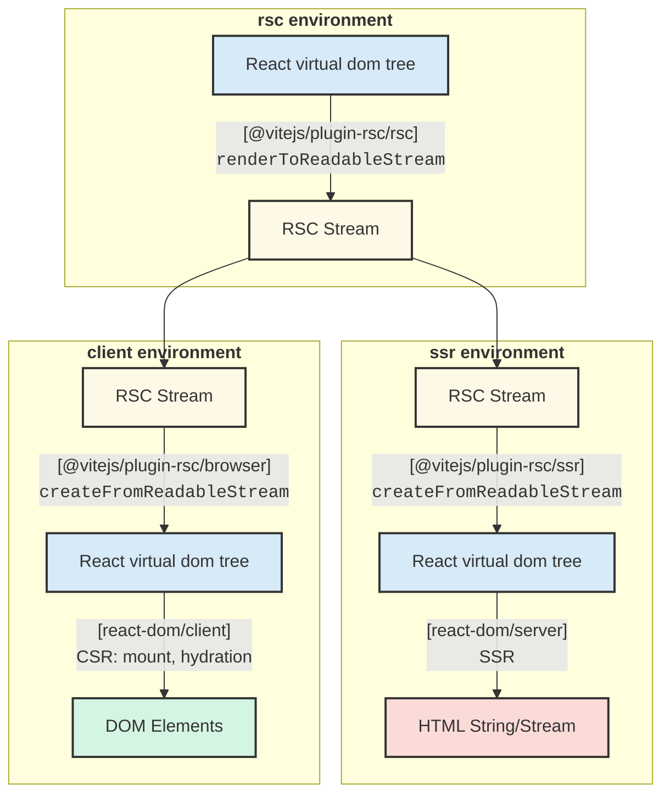

# @vitejs/plugin-rsc

This package provides [React Server Components](https://react.dev/reference/rsc/server-components) (RSC) support for Vite.

## Features

- **Framework-agnostic**: The plugin implements [RSC bundler features](https://react.dev/reference/rsc/server-components) and provides low level RSC runtime (`react-server-dom`) API without framework-specific abstractions.
- **Runtime-agnostic**: Built on [Vite environment API](https://vite.dev/guide/api-environment.html) and works with other runtimes (e.g., [`@cloudflare/vite-plugin`](https://github.com/cloudflare/workers-sdk/tree/main/packages/vite-plugin-cloudflare)).
- **HMR support**: Enables editing both client and server components without full page reloads.
- **CSS support**: CSS is automatically code-split both at client and server components and they are injected upon rendering.

## Getting Started

You can create a starter project by:

```sh
npm create vite@latest -- --template rsc
```

## Examples

**Start here:** [`./examples/starter`](./examples/starter) - Recommended for understanding the package

- Provides an in-depth overview of API with inline comments to explain how they function within RSC-powered React application.

**Integration examples:**

- [`./examples/basic`](./examples/basic) - Advanced RSC features and testing
  - This is mainly used for e2e testing and includes various advanced RSC usages (e.g. `"use cache"` example).
- [`./examples/ssg`](./examples/ssg) - Static site generation with MDX and client components for interactivity.
- [`./examples/react-router`](./examples/react-router) - React Router RSC integration
  - Demonstrates how to integrate [experimental React Router RSC API](https://remix.run/blog/rsc-preview). React Router now provides [official RSC support](https://reactrouter.com/how-to/react-server-components), so it's recommended to follow React Router's official documentation for the latest integration.

## Basic Concepts

This example is a simplified version of [`./examples/starter`](./examples/starter). You can read [`./examples/starter/src/framework/entry.{rsc,ssr,browser}.tsx`](./examples/starter/src/framework) for more in-depth commentary, which includes server function handling and client-side RSC re-fetching/re-rendering.

This is the diagram to show the basic flow of RSC rendering process. See also https://github.com/hi-ogawa/vite-plugins/discussions/606.



- [`vite.config.ts`](./examples/starter/vite.config.ts)

```js
import rsc from '@vitejs/plugin-rsc'
import { defineConfig } from 'vite'

export default defineConfig({
  plugins: [
    // add plugin
    rsc(),
  ],

  // specify entry point for each environment.
  environments: {
    // `rsc` environment loads modules with `react-server` condition.
    // this environment is responsible for:
    // - RSC stream serialization (React VDOM -> RSC stream)
    // - server functions handling
    rsc: {
      build: {
        rollupOptions: {
          input: {
            index: './src/framework/entry.rsc.tsx',
          },
        },
      },
    },

    // `ssr` environment loads modules without `react-server` condition.
    // this environment is responsible for:
    // - RSC stream deserialization (RSC stream -> React VDOM)
    // - traditional SSR (React VDOM -> HTML string/stream)
    ssr: {
      build: {
        rollupOptions: {
          input: {
            index: './src/framework/entry.ssr.tsx',
          },
        },
      },
    },

    // client environment is used for hydration and client-side rendering
    // this environment is responsible for:
    // - RSC stream deserialization (RSC stream -> React VDOM)
    // - traditional CSR (React VDOM -> Browser DOM tree mount/hydration)
    // - refetch and re-render RSC
    // - calling server functions
    client: {
      build: {
        rollupOptions: {
          input: {
            index: './src/framework/entry.browser.tsx',
          },
        },
      },
    },
  },
})
```

- [`entry.rsc.tsx`](./examples/starter/src/framework/entry.rsc.tsx)

```tsx
import { renderToReadableStream } from '@vitejs/plugin-rsc/rsc'

// the plugin assumes `rsc` entry having default export of request handler
export default async function handler(request: Request): Promise<Response> {
  // serialize React VDOM to RSC stream
  const root = (
    <html>
      <body>
        <h1>Test</h1>
      </body>
    </html>
  )
  const rscStream = renderToReadableStream(root)

  // respond direct RSC stream request based on framework's convention
  if (request.url.endsWith('.rsc')) {
    return new Response(rscStream, {
      headers: {
        'Content-type': 'text/x-component;charset=utf-8',
      },
    })
  }

  // delegate to SSR environment for html rendering
  // `loadModule` is a helper API provided by the plugin for multi environment interaction.
  const ssrEntry = await import.meta.viteRsc.loadModule<
    typeof import('./entry.ssr.tsx')
  >('ssr', 'index')
  const htmlStream = await ssrEntry.handleSsr(rscStream)

  // respond html
  return new Response(htmlStream, {
    headers: {
      'Content-type': 'text/html',
    },
  })
}

// add `import.meta.hot.accept` to handle server module change efficiently
if (import.meta.hot) {
  import.meta.hot.accept()
}
```

- [`entry.ssr.tsx`](./examples/starter/src/framework/entry.ssr.tsx)

```tsx
import { createFromReadableStream } from '@vitejs/plugin-rsc/ssr'
import { renderToReadableStream } from 'react-dom/server.edge'

export async function handleSsr(rscStream: ReadableStream) {
  // deserialize RSC stream back to React VDOM
  const root = await createFromReadableStream(rscStream)

  // helper API to allow referencing browser entry content from SSR environment
  const bootstrapScriptContent =
    await import.meta.viteRsc.loadBootstrapScriptContent('index')

  // render html (traditional SSR)
  const htmlStream = renderToReadableStream(root, {
    bootstrapScriptContent,
  })

  return htmlStream
}
```

- [`entry.browser.tsx`](./examples/starter/src/framework/entry.browser.tsx)

```tsx
import { createFromReadableStream } from '@vitejs/plugin-rsc/browser'
import { hydrateRoot } from 'react-dom/client'

async function main() {
  // fetch and deserialize RSC stream back to React VDOM
  const rscResponse = await fetch(window.location.href + '.rsc')
  const root = await createFromReadableStream(rscResponse.body)

  // hydration (traditional CSR)
  hydrateRoot(document, root)
}

main()
```

## Environment helper API

The plugin provides an additional helper for multi environment interaction.

### Available on `rsc` or `ssr` environment

#### `import.meta.viteRsc.loadModule`

- Type: `(environmentName: "ssr" | "rsc", entryName?: string) => Promise<T>`

This allows importing `ssr` environment module specified by `environments.ssr.build.rollupOptions.input[entryName]` inside `rsc` environment and vice versa. When `entryName` is omitted, the function automatically uses the single entry from the target environment's `rollupOptions.input`.

During development, by default, this API assumes both `rsc` and `ssr` environments execute under the main Vite process as `RunnableDevEnvironment`. Internally, `loadModule` uses the global `__VITE_ENVIRONMENT_RUNNER_IMPORT__` function to import modules in the target environment (see [`__VITE_ENVIRONMENT_RUNNER_IMPORT__`](#__vite_environment_runner_import__) below).

When enabling `rsc({ loadModuleDevProxy: true })` plugin option, the loaded module is implemented as a proxy with `fetch`-based RPC to call in node environment on the main Vite process, which for example, allows `rsc` environment inside cloudflare workers to access `ssr` environment on the main Vite process. This proxy mechanism uses [turbo-stream](https://github.com/jacob-ebey/turbo-stream) for serializing data types beyond JSON, with custom encoders/decoders to additionally support `Request` and `Response` instances.

During production build, this API will be rewritten into a static import of the specified entry of other environment build and the modules are executed inside the same runtime.

For example,

```js
// ./entry.rsc.tsx
const ssrModule = await import.meta.viteRsc.loadModule("ssr", "index");
ssrModule.renderHTML(...);

// ./entry.ssr.tsx (with environments.ssr.build.rollupOptions.input.index = "./entry.ssr.tsx")
export function renderHTML(...) {}
```

#### `import.meta.viteRsc.import`

- Type: `<T>(specifier: string, options: { environment: string }) => Promise<T>`

A more ergonomic alternative to `loadModule`:

1. No manual `rollupOptions.input` config needed - entries are auto-discovered
2. Specifier matches the path in `typeof import(...)` type annotations

**Comparison:**

```ts
// Before (loadModule) - requires vite.config.ts:
// environments.ssr.build.rollupOptions.input = { index: './entry.ssr.tsx' }
import.meta.viteRsc.loadModule<typeof import('./entry.ssr.tsx')>('ssr', 'index')

// After (import) - no config needed, auto-discovered
import.meta.viteRsc.import<typeof import('./entry.ssr.tsx')>(
  './entry.ssr.tsx',
  { environment: 'ssr' },
)
```

During development, this works the same as `loadModule`, using the `__VITE_ENVIRONMENT_RUNNER_IMPORT__` function to import modules in the target environment.

During production build, the plugin auto-discovers these imports and emits them as entries in the target environment. A manifest file (`__vite_rsc_env_imports_manifest.js`) is generated to map module specifiers to their output filenames.

### Available on `rsc` environment

#### `import.meta.viteRsc.loadCss`

> [!NOTE]
> The plugin automatically injects CSS for server components. See the [CSS Support](#css-support) section for detailed information about automatic CSS injection.

- Type: `(importer?: string) => React.ReactNode`

This allows collecting css which is imported through a current server module and injecting them inside server components.

```tsx
import './test.css'
import dep from './dep.tsx'

export function ServerPage() {
  // this will include css assets for "test.css"
  // and any css transitively imported through "dep.tsx"
  return (
    <>
      {import.meta.viteRsc.loadCss()}
      ...
    </>
  )
}
```

When specifying `loadCss(<id>)`, it will collect css through the server module resolved by `<id>`.

```tsx
// virtual:my-framework-helper
export function Assets() {
  return <>
    {import.meta.viteRsc.loadCss("/routes/home.tsx")}
    {import.meta.viteRsc.loadCss("/routes/about.tsx")}
    {...}
  </>
}

// user-app.tsx
import { Assets } from "virtual:my-framework-helper";

export function UserApp() {
  return <html>
    <head>
      <Assets />
    </head>
    <body>...</body>
  </html>
}
```

### Available on `ssr` environment

#### `import.meta.viteRsc.loadBootstrapScriptContent("index")`

This provides a raw js code to execute a browser entry file specified by `environments.client.build.rollupOptions.input.index`. This is intended to be used with React DOM SSR API, such as [`renderToReadableStream`](https://react.dev/reference/react-dom/server/renderToReadableStream)

```js
import { renderToReadableStream } from 'react-dom/server.edge'

const bootstrapScriptContent =
  await import.meta.viteRsc.loadBootstrapScriptContent('index')
const htmlStream = await renderToReadableStream(reactNode, {
  bootstrapScriptContent,
})
```

### Available on `client` environment

#### `rsc:update` event

This event is fired when server modules are updated, which can be used to trigger re-fetching and re-rendering of RSC components on browser.

```js
import { createFromFetch } from '@vitejs/plugin-rsc/browser'

import.meta.hot.on('rsc:update', async () => {
  // re-fetch RSC stream
  const rscPayload = await createFromFetch(fetch(window.location.href + '.rsc'))
  // re-render ...
})
```

### Global API

#### `__VITE_ENVIRONMENT_RUNNER_IMPORT__`

- Type: `(environmentName: string, id: string) => Promise<any>`

This global function provides a standardized way to import a module in a given environment during development. It is used internally by `import.meta.viteRsc.loadModule` to execute modules in the target environment.

By default, the plugin sets this global to import via the environment's module runner:

```js
globalThis.__VITE_ENVIRONMENT_RUNNER_IMPORT__ = async (environmentName, id) => {
  return server.environments[environmentName].runner.import(id)
}
```

**Custom Environment Integration:**

Frameworks with custom environment setups (e.g., environments running in separate workers or with custom module loading) can override this global to provide their own module import logic.

```js
// Custom logic to import module between multiple environments inside worker
globalThis.__VITE_ENVIRONMENT_RUNNER_IMPORT__ = async (environmentName, id) => {
  return myWorkerRunners[environmentname].import(id)
}
```

This allows `import.meta.viteRsc.loadModule` to work seamlessly with different runtime configurations without requiring changes to user code.

## Plugin API

### `@vitejs/plugin-rsc`

- Type: `rsc: (options?: RscPluginOptions) => Plugin[]`;

```js
import rsc from '@vitejs/plugin-rsc'
import { defineConfig } from 'vite'

export default defineConfig({
  plugins: [
    rsc({
      // this is only a shorthand of specifying each rollup input via
      // `environments[name].build.rollupOptions.input.index`
      entries: {
        rsc: '...',
        ssr: '...',
        client: '...',
      },

      // by default, the plugin sets up middleware
      // using `default` export of `rsc` environment `index` entry.
      // this behavior can be customized by `serverHandler` option.
      serverHandler: false,

      // the plugin provides build-time validation of 'server-only' and 'client-only' imports.
      // this is enabled by default. See the "server-only and client-only import" section below for details.
      validateImports: true,

      // by default, the plugin uses a build-time generated encryption key for
      // "use server" closure argument binding.
      // This can be overwritten by configuring `defineEncryptionKey` option,
      // for example, to obtain a key through environment variable during runtime.
      // cf. https://nextjs.org/docs/app/guides/data-security#overwriting-encryption-keys-advanced
      defineEncryptionKey: 'process.env.MY_ENCRYPTION_KEY',

      // when `loadModuleDevProxy: true`, `import.meta.viteRsc.loadModule` is implemented
      // through `fetch` based RPC, which allows, for example, rsc environment inside
      // cloudflare workers to communicate with node ssr environment on main Vite process.
      loadModuleDevProxy: true,

      // by default, `loadCss()` helper is injected based on certain heuristics.
      // if it breaks, it can be opt-out or selectively applied based on files.
      rscCssTransform: { filter: (id) => id.includes('/my-app/') },

      // see `RscPluginOptions` for full options ...
    }),
  ],
  // the same options can be also specified via top-level `rsc` property.
  // this allows other plugin to set options via `config` hook.
  rsc: {
    // ...
  },
})
```

## RSC runtime (react-server-dom) API

### `@vitejs/plugin-rsc/rsc`

This module re-exports RSC runtime API provided by `react-server-dom/server.edge` and `react-server-dom/client.edge` such as:

- `renderToReadableStream`: RSC serialization (React VDOM -> RSC stream)
- `createFromReadableStream`: RSC deserialization (RSC stream -> React VDOM). This is also available on rsc environment itself. For example, it allows saving serialized RSC and deserializing it for later use.
- `decodeAction/decodeReply/decodeFormState/loadServerAction/createTemporaryReferenceSet`
- `encodeReply/createClientTemporaryReferenceSet`

#### Vite-specific extension: `renderToReadableStream` (experimental)

> [!NOTE]
> This is a Vite-specific extension to the standard React RSC API. The official `react-server-dom` does not provide this callback mechanism.

`renderToReadableStream` API is extended with an optional third parameter with `onClientReference` callback.
This is invoked whenever a client reference is used in RSC stream rendering.

```ts
function renderToReadableStream<T>(
  data: T,
  // standard options (e.g. temporaryReferences, onError, etc.)
  options?: object,
  // vite-specific options
  extraOptions?: {
    onClientReference?: (metadata: {
      id: string
      name: string
      deps: { js: string[]; css: string[] }
    }) => void
  },
): ReadableStream<Uint8Array>
```

### `@vitejs/plugin-rsc/ssr`

This module re-exports RSC runtime API provided by `react-server-dom/client.edge`

- `createFromReadableStream`: RSC deserialization (RSC stream -> React VDOM)

### `@vitejs/plugin-rsc/browser`

This module re-exports RSC runtime API provided by `react-server-dom/client.browser`

- `createFromReadableStream`: RSC deserialization (RSC stream -> React VDOM)
- `createFromFetch`: a robust way of `createFromReadableStream((await fetch("...")).body)`
- `encodeReply/setServerCallback`: server function related...

## Tips

### CSS Support

The plugin automatically handles CSS code-splitting and injection for server components. This eliminates the need to manually call [`import.meta.viteRsc.loadCss()`](#importmetaviterscloadcss) in most cases.

1. **Component Detection**: The plugin automatically detects server components by looking for:
   - Function exports with capital letter names (e.g., `export function Page() {}`)
   - Default exports that are functions with capital names (e.g., `export default function Page() {}`)
   - Const exports assigned to functions with capital names (e.g., `export const Page = () => {}`)

2. **CSS Import Detection**: For detected components, the plugin checks if the module imports any CSS files (`.css`, `.scss`, `.sass`, etc.)

3. **Automatic Wrapping**: When both conditions are met, the plugin wraps the component with a CSS injection wrapper:

```tsx
// Before transformation
import './styles.css'

export function Page() {
  return <div>Hello</div>
}

// After transformation
import './styles.css'

export function Page() {
  return (
    <>
      {import.meta.viteRsc.loadCss()}
      <div>Hello</div>
    </>
  )
}
```

### Using different React versions

By default, `@vitejs/plugin-rsc` includes a [vendored version](https://github.com/vitejs/vite-plugin-react/blob/main/packages/plugin-rsc/package.json#L64) of `react-server-dom-webpack`. When `react-server-dom-webpack` is installed in your project's dependencies, the plugin will automatically use it instead, allowing you to use any React version you need.

**[Canary](https://react.dev/community/versioning-policy#canary-channel) or [experimental](https://react.dev/community/versioning-policy#experimental-channel) versions:**

```json
{
  "dependencies": {
    "react": "canary",
    "react-dom": "canary",
    "react-server-dom-webpack": "canary"
  }
}
```

**Specific versions (e.g., for security updates):**

```json
{
  "dependencies": {
    "react": "19.2.3",
    "react-dom": "19.2.3",
    "react-server-dom-webpack": "19.2.3"
  }
}
```

### Using `@vitejs/plugin-rsc` as a framework package's `dependencies`

By default, `@vitejs/plugin-rsc` is expected to be used as `peerDependencies` similar to `react` and `react-dom`. When `@vitejs/plugin-rsc` is not available at the project root (e.g., in `node_modules/@vitejs/plugin-rsc`), you will see warnings like:

```sh
Failed to resolve dependency: @vitejs/plugin-rsc/vendor/react-server-dom/client.browser, present in client 'optimizeDeps.include'
```

This can be fixed by updating `optimizeDeps.include` to reference `@vitejs/plugin-rsc` through your framework package. For example, you can add the following plugin:

```js
// package name is "my-rsc-framework"
export default function myRscFrameworkPlugin() {
  return {
    name: 'my-rsc-framework:config',
    configEnvironment(_name, config) {
      if (config.optimizeDeps?.include) {
        config.optimizeDeps.include = config.optimizeDeps.include.map(
          (entry) => {
            if (entry.startsWith('@vitejs/plugin-rsc')) {
              entry = `my-rsc-framework > ${entry}`
            }
            return entry
          },
        )
      }
    },
  }
}
```

### Typescript

Types for global API are defined in `@vitejs/plugin-rsc/types`. For example, you can add it to `tsconfig.json` to have types for `import.meta.viteRsc` APIs:

```json
{
  "compilerOptions": {
    "types": ["vite/client", "@vitejs/plugin-rsc/types"]
  }
}
```

```ts
import.meta.viteRsc.loadModule
//                  ^^^^^^^^^^
// <T>(environmentName: string, entryName?: string) => Promise<T>
```

See also [Vite documentation](https://vite.dev/guide/api-hmr.html#intellisense-for-typescript) for `vite/client` types.

### `server-only` and `client-only` import

<!-- references? -->
<!-- https://nextjs.org/docs/app/getting-started/server-and-client-components#preventing-environment-poisoning -->
<!-- https://overreacted.io/how-imports-work-in-rsc/ -->

You can use the `server-only` import to prevent accidentally importing server-only code into client bundles, which can expose sensitive server code in public static assets.
For example, the plugin will show an error `'server-only' cannot be imported in client build` for the following code:

- server-utils.js

```tsx
import 'server-only'

export async function getData() {
  const res = await fetch('https://internal-service.com/data', {
    headers: {
      authorization: process.env.API_KEY,
    },
  })
  return res.json()
}
```

- client.js

```tsx
'use client'
import { getData } from './server-utils.js' // ❌ 'server-only' cannot be imported in client build
...
```

Similarly, the `client-only` import ensures browser-specific code isn't accidentally imported into server environments.
For example, the plugin will show an error `'client-only' cannot be imported in server build` for the following code:

- client-utils.js

```tsx
import 'client-only'

export function getStorage(key) {
  // This uses browser-only APIs
  return window.localStorage.getItem(key)
}
```

- server.js

```tsx
import { getStorage } from './client-utils.js' // ❌ 'client-only' cannot be imported in server build

export function ServerComponent() {
  const data = getStorage("settings")
  ...
}
```

Note that while there are official npm packages [`server-only`](https://www.npmjs.com/package/server-only) and [`client-only`](https://www.npmjs.com/package/client-only) created by React team, they don't need to be installed. The plugin internally overrides these imports and surfaces their runtime errors as build-time errors.

This build-time validation is enabled by default and can be disabled by setting `validateImports: false` in the plugin options.

## Architecture Documentation

For developers interested in the internal architecture:

- **[docs/architecture.md](docs/architecture.md)** - Build pipeline, data flow, and key components
- **[docs/bundler-comparison.md](docs/bundler-comparison.md)** - How different bundlers approach RSC

## Credits

This project builds on fundamental techniques and insights from pioneering Vite RSC implementations.
Additionally, Parcel and React Router's work on standardizing the RSC bundler/app responsibility has guided this plugin's API design:

- [Waku](https://github.com/wakujs/waku)
- [@lazarv/react-server](https://github.com/lazarv/react-server)
- [@jacob-ebey/vite-react-server-dom](https://github.com/jacob-ebey/vite-plugins/tree/main/packages/vite-react-server-dom)
- [React Router RSC](https://remix.run/blog/rsc-preview)
- [Parcel RSC](https://parceljs.org/recipes/rsc)
