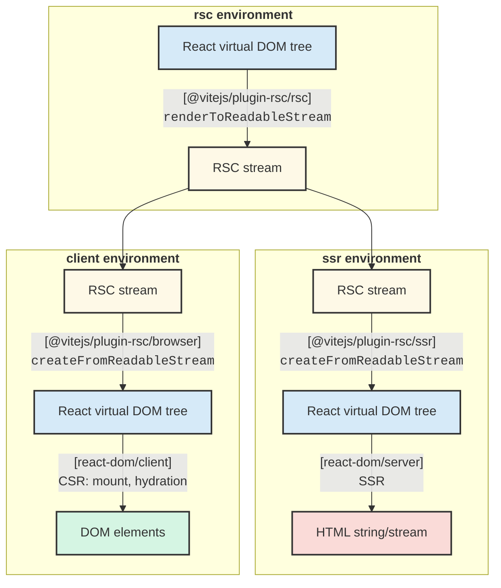

# @vitejs/plugin-rsc

This package provides [React Server Components](https://react.dev/reference/rsc/server-components) (RSC) support for Vite.

## Features

- **Framework-agnostic**: The plugin implements [RSC bundler features](https://react.dev/reference/rsc/server-components) and provides low-level RSC runtime (`react-server-dom`) APIs without framework-specific abstractions.
- **Runtime-agnostic**: The plugin builds on the [Vite Environment API](https://vite.dev/guide/api-environment.html) and supports other runtimes, such as [`@cloudflare/vite-plugin`](https://github.com/cloudflare/workers-sdk/tree/main/packages/vite-plugin-cloudflare).
- **HMR support**: Edit Client and Server Components without a full-page reload.
- **CSS support**: CSS is automatically code-split for Client and Server Components, then injected when the components render.

## Getting Started

Create a starter project with the following command:

```sh
npm create vite@latest -- --template rsc
```

## Examples

**Start here:** [`./examples/starter`](./examples/starter)

This example provides an in-depth API overview, with inline comments that explain how the APIs work in an RSC-powered React application.

**Integration examples:**

- [`./examples/basic`](./examples/basic): A comprehensive showcase of standard RSC features and the primary E2E test fixture.
- [`./examples/use-cache`](./examples/use-cache): A minimal cache feature inspired by Next.js's `"use cache"`, built with generic transform APIs and RSC runtime APIs.
- [`./examples/custom-server-function`](./examples/custom-server-function): An integration of third-party Server Function directives using server reference claims.
- [`./examples/ssg`](./examples/ssg): Static site generation with MDX and interactive Client Components.
- [`./examples/ppr`](./examples/ppr): Partial prerendering with a reusable static HTML shell and request-time RSC content.
- [`./examples/no-ssr`](./examples/no-ssr): An RSC application without an SSR environment.
- [`./examples/client-first`](./examples/client-first): An experimental client-owned page that consumes RSC function results.
- [`./examples/browser-mode`](./examples/browser-mode): An advanced setup that runs both the RSC and React client environments in the browser with custom module loading.
- [`./examples/performance-track`](./examples/performance-track): A minimal probe for React Server Components performance tracks.
- [`./examples/react-router`](./examples/react-router): An integration with the [experimental React Router RSC API](https://remix.run/blog/rsc-preview). React Router now provides [official RSC support](https://reactrouter.com/how-to/react-server-components), so refer to its official documentation for the latest integration guidance.

## Basic Concepts

This example is a simplified version of [`./examples/starter`](./examples/starter). For more detailed commentary, including Server Function handling and client-side RSC refetching and rerendering, read [`./examples/starter/src/framework/entry.{rsc,ssr,browser}.tsx`](./examples/starter/src/framework).

The following diagram shows the basic RSC rendering flow. For more context, see [this discussion](https://github.com/hi-ogawa/vite-plugins/discussions/606).


```mermaid
graph TD

    subgraph "<strong>rsc environment</strong>"
        A["React virtual DOM tree"] --> |"[@vitejs/plugin-rsc/rsc]<br /><code>renderToReadableStream</code>"| B1["RSC stream"];
    end

    B1 --> B2
    B1 --> B3

    subgraph "<strong>ssr environment</strong>"
        B2["RSC stream"] --> |"[@vitejs/plugin-rsc/ssr]<br /><code>createFromReadableStream</code>"| C1["React virtual DOM tree"];
        C1 --> |"[react-dom/server]<br/>SSR"| E["HTML string/stream"];
    end

    subgraph "<strong>client environment</strong>"
        B3["RSC stream"] --> |"[@vitejs/plugin-rsc/browser]<br /><code>createFromReadableStream</code>"| C2["React virtual DOM tree"];
        C2 --> |"[react-dom/client]<br/>CSR: mount, hydration"| D["DOM elements"];
    end

    style A fill:#D6EAF8,stroke:#333,stroke-width:2px
    style B1 fill:#FEF9E7,stroke:#333,stroke-width:2px
    style B2 fill:#FEF9E7,stroke:#333,stroke-width:2px
    style B3 fill:#FEF9E7,stroke:#333,stroke-width:2px
    style C1 fill:#D6EAF8,stroke:#333,stroke-width:2px
    style C2 fill:#D6EAF8,stroke:#333,stroke-width:2px
    style D fill:#D5F5E3,stroke:#333,stroke-width:2px
    style E fill:#FADBD8,stroke:#333,stroke-width:2px
```

- [`vite.config.ts`](./examples/starter/vite.config.ts)

```js
import rsc from '@vitejs/plugin-rsc'
import { defineConfig } from 'vite'

export default defineConfig({
  plugins: [
    // Add the plugin.
    rsc(),
  ],

  // Specify an entry point for each environment.
  environments: {
    // The `rsc` environment loads modules with the `react-server` condition.
    // This environment is responsible for:
    // - RSC stream serialization (React VDOM -> RSC stream)
    // - handling Server Functions
    rsc: {
      build: {
        rollupOptions: {
          input: {
            index: './src/framework/entry.rsc.tsx',
          },
        },
      },
    },

    // The `ssr` environment loads modules without the `react-server` condition.
    // This environment is responsible for:
    // - RSC stream deserialization (RSC stream -> React VDOM)
    // - traditional SSR (React VDOM -> HTML string/stream)
    ssr: {
      build: {
        rollupOptions: {
          input: {
            index: './src/framework/entry.ssr.tsx',
          },
        },
      },
    },

    // The client environment handles hydration and client-side rendering.
    // This environment is responsible for:
    // - RSC stream deserialization (RSC stream -> React VDOM)
    // - traditional CSR (React VDOM -> browser DOM tree mount/hydration)
    // - refetching and rerendering RSC
    // - calling Server Functions
    client: {
      build: {
        rollupOptions: {
          input: {
            index: './src/framework/entry.browser.tsx',
          },
        },
      },
    },
  },
})
```

- [`entry.rsc.tsx`](./examples/starter/src/framework/entry.rsc.tsx)

```tsx
import { renderToReadableStream } from '@vitejs/plugin-rsc/rsc'

// The plugin expects the `rsc` entry's default export to be a request handler.
export default async function handler(request: Request): Promise<Response> {
  // Serialize the React VDOM to an RSC stream.
  const root = (
    <html>
      <body>
        <h1>Test</h1>
      </body>
    </html>
  )
  const rscStream = renderToReadableStream(root)

  // Respond to a direct RSC stream request according to the framework's convention.
  if (request.url.endsWith('.rsc')) {
    return new Response(rscStream, {
      headers: {
        'Content-type': 'text/x-component;charset=utf-8',
      },
    })
  }

  // Delegate HTML rendering to the SSR environment.
  // `loadModule` lets multiple environments interact.
  const ssrEntry = await import.meta.viteRsc.loadModule<
    typeof import('./entry.ssr.tsx')
  >('ssr', 'index')
  const htmlStream = await ssrEntry.handleSsr(rscStream)

  // Respond with HTML.
  return new Response(htmlStream, {
    headers: {
      'Content-type': 'text/html',
    },
  })
}

// Accept server module changes without reloading the page.
if (import.meta.hot) {
  import.meta.hot.accept()
}
```

- [`entry.ssr.tsx`](./examples/starter/src/framework/entry.ssr.tsx)

```tsx
import { createFromReadableStream } from '@vitejs/plugin-rsc/ssr'
import { renderToReadableStream } from 'react-dom/server.edge'

export async function handleSsr(rscStream: ReadableStream) {
  // Deserialize the RSC stream back into a React VDOM.
  const root = await createFromReadableStream(rscStream)

  // Reference browser entry content from the SSR environment.
  const bootstrapScriptContent =
    await import.meta.viteRsc.loadBootstrapScriptContent('index')

  // Render HTML with traditional SSR.
  const htmlStream = renderToReadableStream(root, {
    bootstrapScriptContent,
  })

  return htmlStream
}
```

- [`entry.browser.tsx`](./examples/starter/src/framework/entry.browser.tsx)

```tsx
import { createFromReadableStream } from '@vitejs/plugin-rsc/browser'
import { hydrateRoot } from 'react-dom/client'

async function main() {
  // Fetch and deserialize the RSC stream back into a React VDOM.
  const rscResponse = await fetch(window.location.href + '.rsc')
  const root = await createFromReadableStream(rscResponse.body)

  // Hydrate the server-rendered HTML.
  hydrateRoot(document, root)
}

main()
```

## Environment Helper API

The plugin provides helper APIs for interactions between environments.

### Available in the `rsc` and `ssr` environments

#### `import.meta.viteRsc.loadModule`

- Type: `(environmentName: "ssr" | "rsc", entryName?: string) => Promise<T>`

This API imports an entry from the `ssr` environment into the `rsc` environment, or vice versa. For example, the `ssr` entry is specified by `environments.ssr.build.rollupOptions.input[entryName]`. When you omit `entryName`, the API uses the single entry from the target environment's `rollupOptions.input`.

By default, this API assumes during development that the `rsc` and `ssr` environments run as `RunnableDevEnvironment` instances in the main Vite process. Internally, `loadModule` uses the global [`__VITE_ENVIRONMENT_RUNNER_IMPORT__`](#__vite_environment_runner_import__) function to import modules into the target environment.

When you enable the `rsc({ loadModuleDevProxy: true })` option, the plugin represents the loaded module as a proxy that uses `fetch`-based RPC to make calls in the Node.js environment of the main Vite process. For example, this proxy allows an `rsc` environment running in Cloudflare Workers to access an `ssr` environment in the main Vite process. The proxy uses [turbo-stream](https://github.com/jacob-ebey/turbo-stream) to serialize data types beyond those supported by JSON, with custom encoders and decoders for `Request` and `Response` instances.

During a production build, the plugin rewrites this API as a static import of the specified entry from the other environment's build. The modules then run in the same runtime.

For example:

```js
// ./entry.rsc.tsx
const ssrModule = await import.meta.viteRsc.loadModule("ssr", "index");
ssrModule.renderHTML(...);

// ./entry.ssr.tsx (with environments.ssr.build.rollupOptions.input.index = "./entry.ssr.tsx")
export function renderHTML(...) {}
```

#### `import.meta.viteRsc.import`

- Type: `<T>(specifier: string, options: { environment: string }) => Promise<T>`

This API is a more ergonomic alternative to `loadModule` because:

1. It automatically discovers entries, so you do not need to configure `rollupOptions.input` manually.
2. Its specifier matches the path in the `typeof import(...)` type annotation.

**Comparison:**

```ts
// Before: loadModule requires vite.config.ts configuration.
// environments.ssr.build.rollupOptions.input = { index: './entry.ssr.tsx' }
import.meta.viteRsc.loadModule<typeof import('./entry.ssr.tsx')>('ssr', 'index')

// After: import discovers the entry without configuration.
import.meta.viteRsc.import<typeof import('./entry.ssr.tsx')>(
  './entry.ssr.tsx',
  { environment: 'ssr' },
)
```

During development, this API works like `loadModule`: it uses the `__VITE_ENVIRONMENT_RUNNER_IMPORT__` function to import modules into the target environment.

During a production build, the plugin discovers these imports and emits them as entries in the target environment. It also generates a manifest file (`__vite_rsc_env_imports_manifest.js`) that maps module specifiers to their output filenames.

### Available in the `rsc` environment

#### `import.meta.viteRsc.loadCss`

> [!NOTE]
> The plugin automatically injects CSS for Server Components. See the [CSS Support](#css-support) section for detailed information about automatic CSS injection.

- Type: `(importer?: string) => React.ReactNode`

This API collects CSS imported directly or transitively by the current server module and injects it into Server Components.

```tsx
import './test.css'
import dep from './dep.tsx'

export function ServerPage() {
  // Include CSS assets for "test.css" and any CSS imported transitively
  // through "dep.tsx".
  return (
    <>
      {import.meta.viteRsc.loadCss()}
      ...
    </>
  )
}
```

When you specify `loadCss(<id>)`, the API collects CSS through the server module resolved from `<id>`.

```tsx
// virtual:my-framework-helper
export function Assets() {
  return <>
    {import.meta.viteRsc.loadCss("/routes/home.tsx")}
    {import.meta.viteRsc.loadCss("/routes/about.tsx")}
    {...}
  </>
}

// user-app.tsx
import { Assets } from "virtual:my-framework-helper";

export function UserApp() {
  return <html>
    <head>
      <Assets />
    </head>
    <body>...</body>
  </html>
}
```

### Available in the `ssr` environment

#### `import.meta.viteRsc.loadBootstrapScriptContent("index")`

This API returns the raw JavaScript needed to execute the browser entry specified by `environments.client.build.rollupOptions.input.index`. Use it with a React DOM SSR API such as [`renderToReadableStream`](https://react.dev/reference/react-dom/server/renderToReadableStream).

```js
import { renderToReadableStream } from 'react-dom/server.edge'

const bootstrapScriptContent =
  await import.meta.viteRsc.loadBootstrapScriptContent('index')
const htmlStream = await renderToReadableStream(reactNode, {
  bootstrapScriptContent,
})
```

### Available in the `client` environment

#### `rsc:update` event

This event fires when server modules are updated. Use it to trigger the refetching and rerendering of RSC components in the browser.

```js
import { createFromFetch } from '@vitejs/plugin-rsc/browser'

import.meta.hot.on('rsc:update', async () => {
  // Refetch the RSC stream.
  const rscPayload = await createFromFetch(fetch(window.location.href + '.rsc'))
  // Rerender the components.
})
```

### Global API

#### `__VITE_ENVIRONMENT_RUNNER_IMPORT__`

- Type: `(environmentName: string, id: string) => Promise<any>`

During development, this global function provides a standard way to import a module into a specified environment. `import.meta.viteRsc.loadModule` uses it internally to execute modules in the target environment.

By default, the plugin configures this global to import modules through the environment's module runner:

```js
globalThis.__VITE_ENVIRONMENT_RUNNER_IMPORT__ = async (environmentName, id) => {
  return server.environments[environmentName].runner.import(id)
}
```

**Custom environment integration:**

Frameworks can override this global with their own module import logic when environments run in separate workers or use custom module loading.

```js
// Import modules between environments inside a worker.
globalThis.__VITE_ENVIRONMENT_RUNNER_IMPORT__ = async (environmentName, id) => {
  return myWorkerRunners[environmentname].import(id)
}
```

This override lets `import.meta.viteRsc.loadModule` support different runtime configurations without changes to application code.

## Plugin API

### `@vitejs/plugin-rsc`

- Type: `rsc: (options?: RscPluginOptions) => Plugin[]`

```js
import rsc from '@vitejs/plugin-rsc'
import { defineConfig } from 'vite'

export default defineConfig({
  plugins: [
    rsc({
      // This is shorthand for specifying each Rollup input through
      // `environments[name].build.rollupOptions.input.index`.
      entries: {
        rsc: '...',
        ssr: '...',
        client: '...',
      },

      // By default, the plugin configures middleware that uses the default
      // export of the `rsc` environment's `index` entry. Customize this
      // behavior with the `serverHandler` option.
      serverHandler: false,

      // The plugin validates 'server-only' and 'client-only' imports at build
      // time by default. See the "server-only and client-only imports" section.
      validateImports: true,

      // By default, the plugin generates an encryption key at build time for
      // "use server" closure argument binding. Use `defineEncryptionKey` to
      // configure another key source, such as an environment variable read at
      // runtime. See:
      // https://nextjs.org/docs/app/guides/data-security#overwriting-encryption-keys-advanced
      defineEncryptionKey: 'process.env.MY_ENCRYPTION_KEY',

      // When `loadModuleDevProxy` is true, `import.meta.viteRsc.loadModule`
      // uses `fetch`-based RPC. For example, an RSC environment in Cloudflare
      // Workers can communicate with a Node.js SSR environment in the main
      // Vite process.
      loadModuleDevProxy: true,

      // By default, the plugin injects the `loadCss()` helper based on a set of
      // heuristics. You can disable the transform or apply it selectively by file.
      rscCssTransform: { filter: (id) => id.includes('/my-app/') },

      // See `RscPluginOptions` for all available options.
    }),
  ],
  // You can also specify these options through the top-level `rsc` property.
  // This lets other plugins set options through the `config` hook.
  rsc: {
    // ...
  },
})
```

## RSC Runtime (`react-server-dom`) API

### `@vitejs/plugin-rsc/rsc/server`

This module provides Vite-integrated RSC runtime APIs based on `react-server-dom/server.edge` for use in the RSC environment:

- `renderToReadableStream`: RSC serialization (React VDOM -> RSC stream)
- `decodeAction/decodeReply/decodeFormState/loadServerAction`
- `registerClientReference/registerServerReference`
- `createTemporaryReferenceSet`

### `@vitejs/plugin-rsc/rsc/static`

This module provides a Vite-integrated RSC runtime API based on `react-server-dom/static.edge` for use in the RSC environment:

- `prerender`: static RSC serialization (React VDOM -> RSC stream)

`prerender` supports the same Vite-specific `onClientReference` extension as `renderToReadableStream`.

### `@vitejs/plugin-rsc/rsc/client`

This module provides Vite-integrated RSC runtime APIs based on `react-server-dom/client.edge` for use in the RSC environment:

- `createFromReadableStream`: RSC deserialization (RSC stream -> React VDOM)
- `encodeReply`
- `createClientTemporaryReferenceSet`

Together, these APIs allow a React VDOM to be serialized, saved as an RSC stream, and later deserialized within the same `rsc` environment.

### `@vitejs/plugin-rsc/rsc`

This module re-exports `@vitejs/plugin-rsc/rsc/server` and `@vitejs/plugin-rsc/rsc/client`.

#### Vite-specific extension: `renderToReadableStream` (experimental)

> [!NOTE]
> This is a Vite-specific extension to the standard React RSC API. The official `react-server-dom` does not provide this callback mechanism.

The `renderToReadableStream` API accepts an optional third parameter with an `onClientReference` callback. The callback runs whenever RSC stream rendering uses a client reference.

```ts
function renderToReadableStream<T>(
  data: T,
  // Standard options, such as temporaryReferences and onError.
  options?: object,
  // vite-specific options
  extraOptions?: {
    onClientReference?: (metadata: {
      id: string
      name: string
      deps: { js: string[]; css: string[] }
    }) => void
  },
): ReadableStream<Uint8Array>
```

### `@vitejs/plugin-rsc/ssr`

This module provides Vite-integrated RSC runtime APIs based on `react-server-dom/client.edge` for use in the SSR environment:

- `createFromReadableStream`: Deserializes an RSC stream into a React VDOM
- `encodeReply`: Serializes Server Function arguments
- `createTemporaryReferenceSet`: Creates a temporary reference set shared by deserialization and reply serialization

### `@vitejs/plugin-rsc/browser`

This module provides Vite-integrated RSC runtime APIs based on `react-server-dom/client.browser` for use in the browser environment:

- `createFromReadableStream`: Deserializes an RSC stream into a React VDOM
- `createFromFetch`: Deserializes an RSC response from a fetch promise
- `encodeReply`: Serializes Server Function arguments
- `createTemporaryReferenceSet`: Creates a temporary reference set shared by deserialization and reply serialization
- `setServerCallback`: Configures how Server Functions are called

### Low-Level Runtime Entry Points

The runtime APIs are exposed through two layers:

- `@vitejs/plugin-rsc/rsc`, `@vitejs/plugin-rsc/ssr`, and `@vitejs/plugin-rsc/browser` are the recommended entry points for application and framework runtime code. They initialize the plugin's built-in module loading from the manifests generated by Vite and re-export the corresponding React runtime APIs described above.
- `@vitejs/plugin-rsc/react/rsc`, `@vitejs/plugin-rsc/react/ssr`, and `@vitejs/plugin-rsc/react/browser` are low-level runtime adapters. Code generated for `"use client"` and `"use server"` uses these adapters, as do custom integrations that load modules through `setRequireModule` instead of the plugin's generated manifests.

The two layers share the same module loader within an environment. After a top-level entry initializes the built-in loader, generated code can use `/react/*`. Application code should continue to use the top-level entries, which re-export the same runtime APIs. Only custom integrations that install their own loaders need to use `/react/*` directly. One example is [`examples/browser-mode`](./examples/browser-mode), which runs the RSC and React client environments in the browser.

## Tips

### CSS Support

The plugin automatically handles CSS code-splitting and injection for Server Components. This eliminates the need to manually call [`import.meta.viteRsc.loadCss()`](#importmetaviterscloadcss) in most cases.

1. **Component detection**: The plugin automatically detects Server Components by looking for:
   - Function exports with capitalized names (for example, `export function Page() {}`)
   - Default exports that are functions with capitalized names (for example, `export default function Page() {}`)
   - `const` exports assigned to functions with capitalized names (for example, `export const Page = () => {}`)

2. **CSS import detection**: For each detected component, the plugin checks whether its module imports any CSS files (`.css`, `.scss`, `.sass`, and so on).

3. **Automatic wrapping**: When both conditions are met, the plugin wraps the component with a CSS injection wrapper:

```tsx
// Before transformation
import './styles.css'

export function Page() {
  return <div>Hello</div>
}

// After transformation
import './styles.css'

export function Page() {
  return (
    <>
      {import.meta.viteRsc.loadCss()}
      <div>Hello</div>
    </>
  )
}
```

### Using Different React Versions

By default, `@vitejs/plugin-rsc` includes a [vendored version](https://github.com/vitejs/vite-plugin-react/blob/main/packages/plugin-rsc/package.json#L64) of `react-server-dom-webpack`. If your project declares `react-server-dom-webpack` as a dependency, the plugin uses that version instead. This lets you choose the React version your project needs.

**[Canary](https://react.dev/community/versioning-policy#canary-channel) or [experimental](https://react.dev/community/versioning-policy#experimental-channel) versions:**

```json
{
  "dependencies": {
    "react": "canary",
    "react-dom": "canary",
    "react-server-dom-webpack": "canary"
  }
}
```

**Specific versions, such as for security updates:**

```json
{
  "dependencies": {
    "react": "19.2.3",
    "react-dom": "19.2.3",
    "react-server-dom-webpack": "19.2.3"
  }
}
```

### Using `@vitejs/plugin-rsc` as a Framework Dependency

Like `react` and `react-dom`, `@vitejs/plugin-rsc` is normally declared in a framework package's `peerDependencies`. If `@vitejs/plugin-rsc` is not available at the project root, such as at `node_modules/@vitejs/plugin-rsc`, you will see warnings like this:

```sh
Failed to resolve dependency: @vitejs/plugin-rsc/vendor/react-server-dom/client.browser, present in client 'optimizeDeps.include'
```

To fix the warning, update `optimizeDeps.include` to reference `@vitejs/plugin-rsc` through your framework package. For example, add the following plugin:

```js
// package name is "my-rsc-framework"
export default function myRscFrameworkPlugin() {
  return {
    name: 'my-rsc-framework:config',
    configEnvironment(_name, config) {
      if (config.optimizeDeps?.include) {
        config.optimizeDeps.include = config.optimizeDeps.include.map(
          (entry) => {
            if (entry.startsWith('@vitejs/plugin-rsc')) {
              entry = `my-rsc-framework > ${entry}`
            }
            return entry
          },
        )
      }
    },
  }
}
```

### TypeScript

Types for the global APIs are defined in `@vitejs/plugin-rsc/types`. Add this package to `tsconfig.json` to enable types for the `import.meta.viteRsc` APIs:

```json
{
  "compilerOptions": {
    "types": ["vite/client", "@vitejs/plugin-rsc/types"]
  }
}
```

```ts
import.meta.viteRsc.loadModule
//                  ^^^^^^^^^^
// <T>(environmentName: string, entryName?: string) => Promise<T>
```

See the [Vite documentation](https://vite.dev/guide/api-hmr.html#intellisense-for-typescript) for information about the `vite/client` types.

### `server-only` and `client-only` Imports

<!-- references? -->
<!-- https://nextjs.org/docs/app/getting-started/server-and-client-components#preventing-environment-poisoning -->
<!-- https://overreacted.io/how-imports-work-in-rsc/ -->

Use the `server-only` import to prevent server-only code from being imported into client bundles, where public static assets could expose sensitive code. For example, the plugin reports the error `'server-only' cannot be imported in client build` for the following code:

- server-utils.js

```tsx
import 'server-only'

export async function getData() {
  const res = await fetch('https://internal-service.com/data', {
    headers: {
      authorization: process.env.API_KEY,
    },
  })
  return res.json()
}
```

- client.js

```tsx
'use client'
import { getData } from './server-utils.js' // ❌ 'server-only' cannot be imported in client build
...
```

Similarly, the `client-only` import prevents browser-specific code from being imported into server environments. The plugin reports the error `'client-only' cannot be imported in server build` for the following code:

- client-utils.js

```tsx
import 'client-only'

export function getStorage(key) {
  // This uses browser-only APIs
  return window.localStorage.getItem(key)
}
```

- server.js

```tsx
import { getStorage } from './client-utils.js' // ❌ 'client-only' cannot be imported in server build

export function ServerComponent() {
  const data = getStorage("settings")
  ...
}
```

Although the React team publishes the [`server-only`](https://www.npmjs.com/package/server-only) and [`client-only`](https://www.npmjs.com/package/client-only) npm packages, you do not need to install them. The plugin overrides these imports internally and reports their runtime errors at build time.

This build-time validation is enabled by default. To disable it, set `validateImports: false` in the plugin options.

## Credits

This project builds on techniques and insights from pioneering Vite RSC implementations. Work by Parcel and React Router to standardize the responsibilities of RSC bundlers and applications has also guided the plugin's API design:

- [Waku](https://github.com/wakujs/waku)
- [@lazarv/react-server](https://github.com/lazarv/react-server)
- [@jacob-ebey/vite-react-server-dom](https://github.com/jacob-ebey/vite-plugins/tree/main/packages/vite-react-server-dom)
- [React Router RSC](https://remix.run/blog/rsc-preview)
- [Parcel RSC](https://parceljs.org/recipes/rsc)
